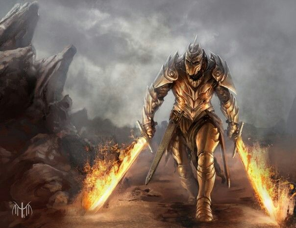

<h1 align="center">Bienvenidos a mi blog aventurero</h1>

Recuerdo bien aquel día. El cielo estaba gris, y el suelo temblaba con cada paso de la bestia. Un coloso de escamas negras, con colmillos como lanzas y ojos que ardían como brasas. Lo llamaban Kraghor, el Devorador del Valle. Muchos habían huido. Yo no.

Con la espada firme lo atacaba sin darle ni respiro. Con cada golpe lo fui derribando hasta que cayó, derrotado, con un estruendo que sacudió la tierra. Kraghor ya no volvería a alzarse. Me alejé sin mirar atrás. La batalla había terminado.

